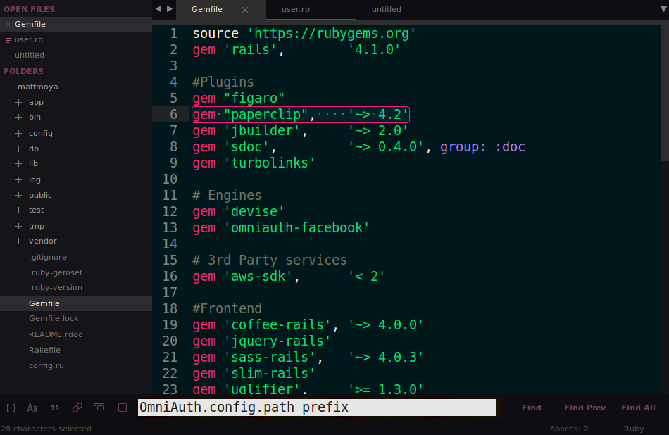
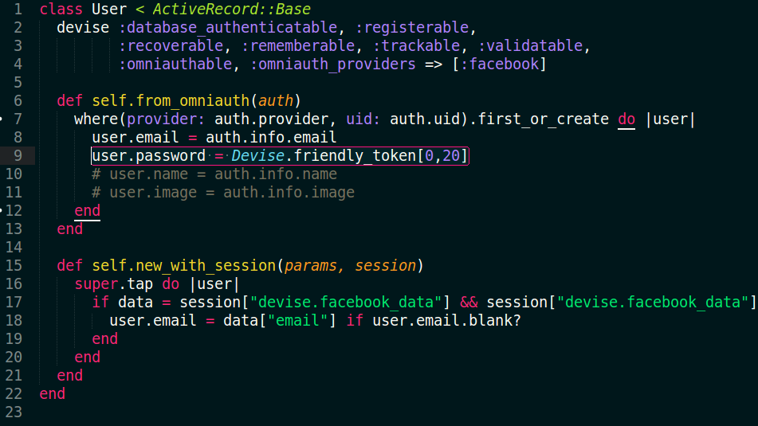

# Ksix theme

This is a modification of [Afterglow theme](https://github.com/YabataDesign/afterglow-theme) for sublime text 3 with a customized color scheme based on [Monokai Flatland](https://github.com/thinkpixellab/flatland).

#### Theme Preview



#### Color scheme preview



## Installation

### Package Control

The easiest way to install is using [Sublime Package Control](https://sublime.wbond.net/).

* Open `Command Palette` using menu item `Tools -> Command Palette...`, or `Cmd+Shift+P` (OS X) `Ctrl+Shift+P` (Win/Linux)
* Type `Package Control: Install Package`
* Search `Theme - Ksix`


### Git Installation

Locate your Sublime Text `Packages directory` by using the menu item `Preferences -> Browse Packages...`.

Then, clone the repository using this command:

    git clone https://github.com/matiasmoya/theme-ksix.git/ "Theme - Ksix"


### Manual installation

* Download the [GitHub .zip](https://github.com/matiasmoya/theme-ksix/archive/master.zip)
* Unzip the files and rename the folder to `Theme - Ksix`
* Find your `Packages` directory using the menu item  `Preferences -> Browse Packages...`
* Copy the folder into your Sublime Text `Packages` directory.


## Activating the Theme

Activate this theme and color scheme by modifying your user preferences file, which you can find using the menu item `Sublime Text -> Preferences -> Settings - User`.

Then add the following code settings, depending on the theme you choose. **(After activating the theme, you must restart Sublime Text.)**

### Settings for Ksix

```json
{
    "theme": "Ksix.sublime-theme",
    "color_scheme": "Packages/Theme - Ksix/Ksix.tmTheme"
}
```
